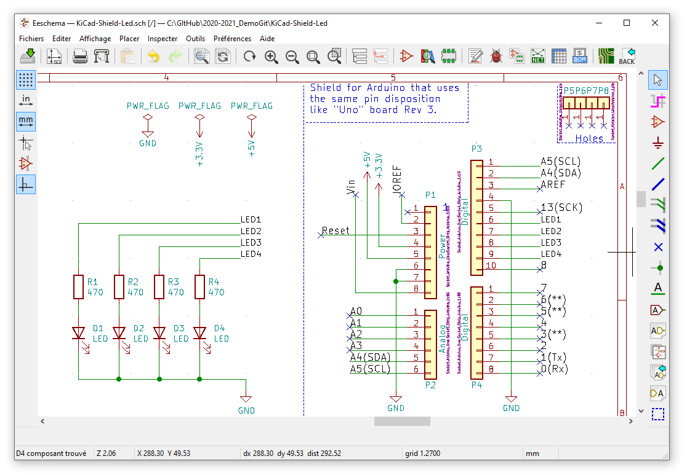
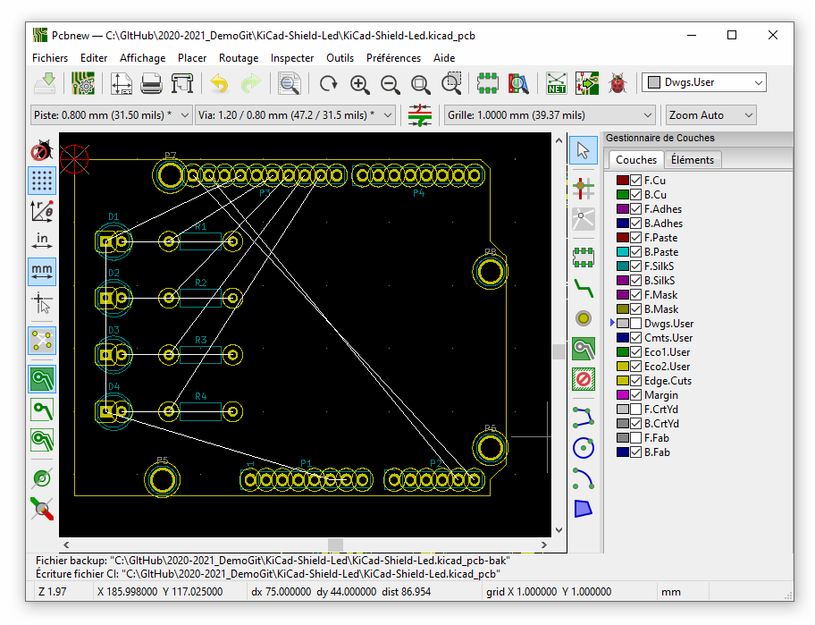
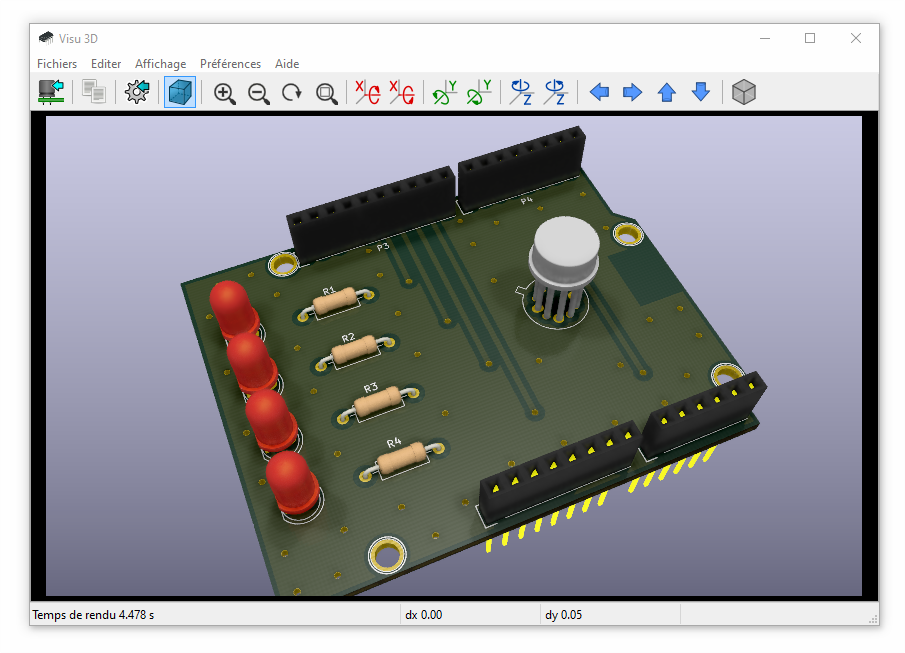

# 2020-2021_DemoGit

My New Project

---

## TODO

- [x] Ajouter de nouveaux fichiers
- [x] Les ajouter à l'index de suivi
- [x] Faire un commit (en local sur mon PC)
- [x] Pousser le ou les commit vers le serveur
- [ ] Créer une nouvelle branche
- [ ] Basculer sur cette branche

---

## Tools used

### KiCad

[KiCad EDA - Schematic Capture & PCB Design Software](https://kicad-pcb.org/), version: 5.1.7

Open source EDA / electronics CAD software for Windows, macOS and Linux.

## Electrical diagram

## Component placement

## Création des librairies

### Les symboles

### Les empreintes

${KISYS3DMOD}/Package_TO_SOT_THT.3dshapes/TO-5-4_Window.wrl

